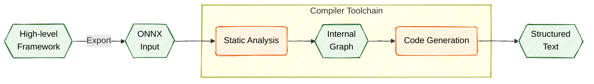

```mermaid
%%{init: {'look': 'handDrawn', 'theme': 'default'}}%%
flowchart LR
    %% --- Styling ---
    %% 1. Representations: Hexagon shape, Light Green (from your palette)
    %% The Hexagon {{ }} implies a distinct state, asset, or module.
    classDef rep shape:hexagon,fill:#e8f5e8,stroke:#1b5e20,stroke-width:1px,color:black
    
    %% 2. Actions: Rounded Rect, Light Orange (from your palette)
    %% The Rounded Rect ( ) implies a process or transformation.
    classDef action shape:rounded,fill:#fff3e0,stroke:#e65100,stroke-width:1px,color:black

    %% --- Nodes ---
    %% Group 1: The Representations (Data/State)
    %% {{ ... }} denotes the Hexagon shape
    Source{{High-level<br/>Framework}}:::rep
    Input{{ONNX<br/>Input}}:::rep
    Graph{{Internal<br/>Graph}}:::rep
    Output{{Structured<br/>Text}}:::rep

    %% Group 2: The Actions (Transformations)
    Analysis("Static Analysis"):::action
    Gen("Code Generation"):::action

    %% --- Connections ---
    Source -->|Export| Input

    subgraph Toolchain ["Compiler Toolchain"]
        direction LR
        Analysis --> Graph
        Graph --> Gen
    end

    Input --> Analysis
    Gen --> Output
```